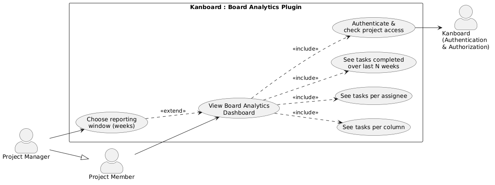
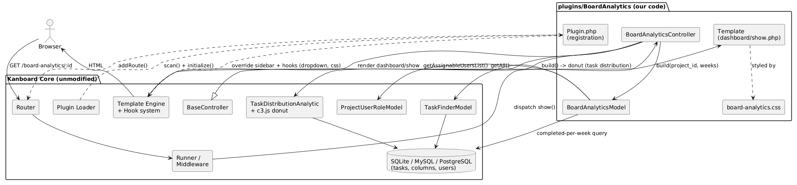
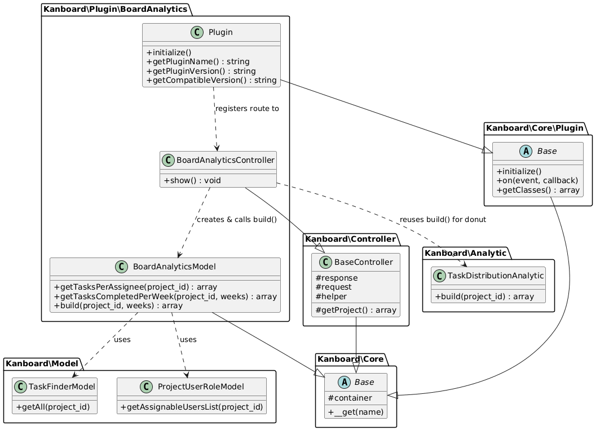
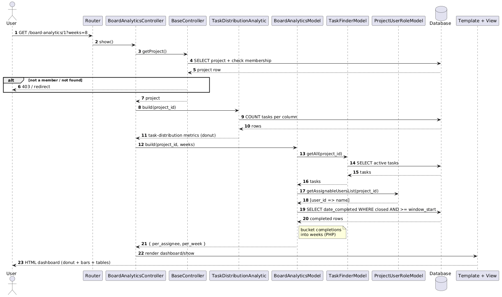
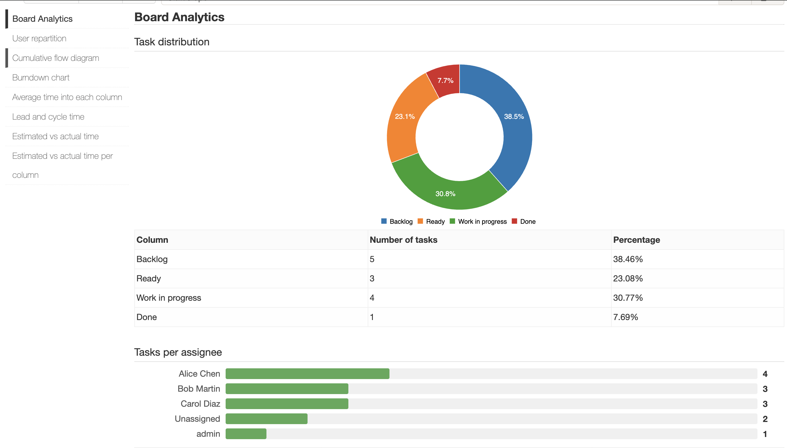
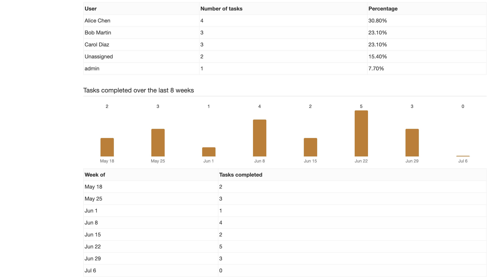
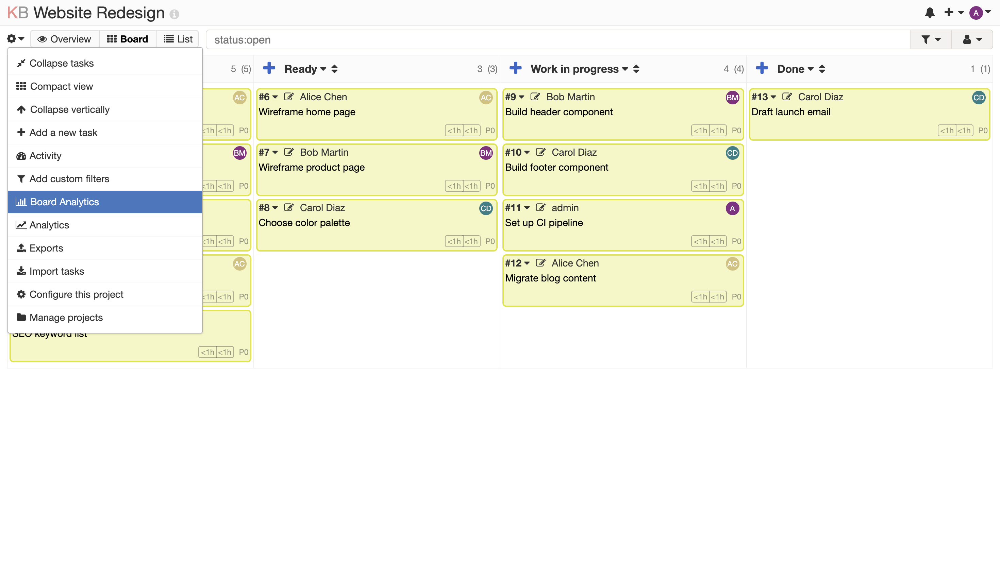

# System Design Document
## Board Analytics — a Kanboard Plugin

**COMP 354 – Introduction to Software Engineering · Summer 2026, Section BB**
**Team name / number: 65711**

| # | Team Member | Student ID |
|---|-------------|-----------|
| 1 | Arad Hajari | 40242069 |
| 2 | Raagav Prasanna | 40282749 |
| 3 | Marck Angelo Geli | 40265711 |
| 4 | Arshdeep Singh | 40286514 |
| 5 | Aarsh Patel | 40295201 |
| 6 | Eric Le | 40297013 |

**Document type:** Development Project Report (System Design Document)
**Deliverable:** Part One — handed to the maintenance team together with the source code
**Version:** 1.0 · **Date:** July 2026

---

## Table of Contents

1. [Introduction](#1-introduction)
2. [Requirements](#2-requirements)
3. [Use-Case Model](#3-use-case-model)
4. [System Architecture](#4-system-architecture)
5. [Class Design](#5-class-design)
6. [Dynamic Behaviour (Sequence)](#6-dynamic-behaviour-sequence)
7. [Data Design](#7-data-design)
8. [User-Interface Design](#8-user-interface-design)
9. [Testing](#9-testing)
10. [Installation, Maintenance & Hand-Over](#10-installation-maintenance--hand-over)
11. [Requirements Traceability](#11-requirements-traceability)
12. [Appendix](#appendix--file-inventory)

---

## 1. Introduction

### 1.1 Purpose
This document describes the design of **Board Analytics**, a plugin we added to the
open-source project-management tool **Kanboard**. It is the design counterpart to our
Project Proposal and is written so that a **future maintenance team** can understand,
run, extend, and support the feature without having to reverse-engineer the code.

### 1.2 Scope
Board Analytics adds one self-contained, **read-only** statistics page to each Kanboard
project. From data that already exists on the board it shows:

1. **Task distribution** — a donut of active tasks per column (reuses Kanboard's own report).
2. **Tasks per assignee** — how the workload is split between team members.
3. **Tasks completed over the last _N_ weeks** — throughput, one bar per week.

The feature is delivered **entirely as a plugin** under `plugins/BoardAnalytics/`.
**No Kanboard core file is modified**, which keeps the upstream project untouched and
makes the plugin easy to install, remove, and maintain.

### 1.3 Definitions and Abbreviations
| Term | Meaning |
|------|---------|
| **Kanboard** | The host open-source Kanban application (PHP, MIT license). |
| **Plugin** | A folder under `plugins/` that extends Kanboard through public hooks. |
| **Column** | A vertical lane of a board (e.g. Backlog, Ready, Work in progress, Done). |
| **Active / open task** | A task with `is_active = 1`. |
| **Closed / completed task** | A task with `is_active = 0` and a `date_completed` timestamp. |
| **Assignee / owner** | The user a task is assigned to (`owner_id`); `0` means unassigned. |
| **Hook** | A named extension point Kanboard exposes for plugins (routes, templates, assets). |
| **DIC** | Dependency-Injection Container (Pimple) that Kanboard uses to wire services. |

### 1.4 References
- Kanboard source: <https://github.com/kanboard/kanboard> (MIT)
- Kanboard developer / plugin guide: <https://docs.kanboard.org/v1/developer/plugins/>
- Project Proposal: *COMP 354 – Project Proposal – Team 65711*

---

## 2. Requirements

### 2.1 Functional Requirements
| ID | Requirement |
|----|-------------|
| **FR1** | The system shall provide a "Board Analytics" page scoped to a single project. |
| **FR2** | The page shall display a **task-distribution** chart (active tasks per column) as a donut, with per-column percentages, reusing Kanboard's built-in report. |
| **FR3** | The page shall display the number of **active tasks per assignee**, grouping unassigned tasks under "Unassigned". |
| **FR4** | The page shall display the number of **tasks completed per week** over a trailing window (default 8 weeks), including weeks with zero completions. |
| **FR5** | The reporting window shall be adjustable via a `weeks` request parameter, clamped to a safe range (4–26). |
| **FR6** | Each metric shall be shown both as a chart and as an exact data table. |
| **FR7** | The page shall be reachable from the project menu and from the Analytics sidebar. |
| **FR8** | The feature shall not modify board data (read-only). |

### 2.2 Non-Functional Requirements
| ID | Requirement |
|----|-------------|
| **NFR1 – Maintainability** | Implemented as a plugin with no changes to Kanboard core; all analytics logic isolated in one model class. |
| **NFR2 – Portability** | Metrics shall work on all databases Kanboard supports (SQLite, MySQL, PostgreSQL). Week bucketing is done in PHP, not with DB-specific date functions. |
| **NFR3 – Security** | The page shall reuse Kanboard's authentication and project-access control; only project members may view a project's analytics. |
| **NFR4 – No new dependencies** | The plugin adds no CDN or third-party library: our own charts are plain CSS/HTML, and the task-distribution donut reuses Kanboard's already-bundled `c3.js`. The page works offline. |
| **NFR5 – Compatibility** | Compatible with Kanboard `>= 1.2.0` (verified on v1.2.52). |
| **NFR6 – Licensing** | Distributed under the MIT license, consistent with Kanboard. |

### 2.3 Assumptions and Constraints
- The plugin relies on Kanboard's existing `tasks`, `columns`, and `users` tables; it
  introduces **no schema of its own**.
- "Completed" is defined by Kanboard's own task-closing mechanism
  (`is_active = 0`, `date_completed` set).
- The host Kanboard installation and its DB are assumed to be correctly configured.

---

## 3. Use-Case Model

### 3.1 Actors
- **Project Member** — an authenticated user who belongs to the project; can view the dashboard.
- **Project Manager** — a member with elevated interest who also tunes the reporting window; a specialization of Project Member.
- **Kanboard (Authentication & Authorization)** — the host system that verifies identity and project access before the page renders.

### 3.2 Use-Case Diagram


*(Source: `diagrams/use-case.puml`)*

### 3.3 Main Use Case — "View Board Analytics Dashboard"
| Field | Description |
|-------|-------------|
| **ID / Name** | UC1 – View Board Analytics Dashboard |
| **Primary actor** | Project Member |
| **Pre-conditions** | User is logged in and is a member of the project. |
| **Trigger** | User opens the project menu → *Board Analytics*, or the Analytics sidebar → *Board Analytics*. |
| **Main flow** | 1. User requests `/board-analytics/<project_id>`. 2. Kanboard authenticates the user and verifies project membership. 3. The controller builds the task-distribution donut data and asks the model for the assignee and weekly metrics. 4. The queries read columns, tasks, and completion dates. 5. The page renders three sections, each a chart plus a data table. |
| **Alternate flow (A1)** | At step 2, if the user is not a member, Kanboard denies access (403 / redirect) and the dashboard is not shown. |
| **Extension (E1 – choose window)** | The user appends `?weeks=N`; the value is clamped to 4–26 and the throughput chart re-scales. |
| **Post-conditions** | The dashboard is displayed; no board data is changed. |

---

## 4. System Architecture

Board Analytics follows Kanboard's **Model–View–Controller** structure and plugs into
the host through three public extension points only: **route registration**,
**template hooks** (menu links), and an **asset hook** (stylesheet). The plugin never
edits a core file; at start-up Kanboard's *Plugin Loader* scans `plugins/`, calls the
plugin's `initialize()`, and from then on the new route and menu links behave like
native features.



*(Source: `diagrams/component.puml`)*

**Layering**
- **Controller** (`BoardAnalyticsController`) — thin: resolves the project, reads the
  optional `weeks` parameter, delegates to the model, and hands the result to the view.
- **Model** (`BoardAnalyticsModel`) — all analytics logic; the single place to change
  or extend metrics. Reuses Kanboard's `TaskDistributionAnalytic`, `TaskFinderModel`, and
  `ProjectUserRoleModel` instead of duplicating queries.
- **View** (`Template/dashboard/show.php` + `board-analytics.css`) — presentation only;
  renders CSS bar charts and data tables.

---

## 5. Class Design



*(Source: `diagrams/class.puml`)*

**Key classes**

| Class | Responsibility |
|-------|----------------|
| `Plugin` | Registers the route, the two menu links, and the stylesheet in `initialize()`; declares plugin metadata (name, version, compatible version). Extends `Kanboard\Core\Plugin\Base`. |
| `BoardAnalyticsController` | Handles the HTTP request (`show()`): access check via `getProject()`, parameter validation, delegation, response rendering. Also reuses Kanboard's `TaskDistributionAnalytic` for the donut. Extends `BaseController`. |
| `BoardAnalyticsModel` | Computes the two plugin-specific metrics: `getTasksPerAssignee()`, `getTasksCompletedPerWeek()`, and the aggregate `build()`. Extends `Kanboard\Core\Base` for DIC access. |

Access to shared services (`db`, `taskDistributionAnalytic`, `taskFinderModel`,
`projectUserRoleModel`) is provided by Kanboard's DIC through the `Base` class's
`__get()` magic method, so the plugin classes stay small and declare no wiring of their own.

---

## 6. Dynamic Behaviour (Sequence)

The sequence below shows a single request to view the dashboard, including the
access-control branch and the three metric queries.



*(Source: `diagrams/sequence.puml`)*

Notable design points visible in the sequence:
- **Access control happens first** (`getProject()`), before any analytics work.
- The **completed-per-week** metric fetches raw completion timestamps and buckets them
  **in PHP**, keeping the SQL database-agnostic (NFR2).
- The controller gathers the donut data (`TaskDistributionAnalytic`) plus the model's
  `per_assignee` and `per_week` results, and the view renders all three sections.

---

## 7. Data Design

The plugin adds **no tables**. It reads three existing Kanboard tables:

| Table | Columns used | Used for |
|-------|--------------|----------|
| `tasks` | `project_id`, `column_id`, `owner_id`, `is_active`, `date_completed` | assignee counts, completion timeline |
| `columns` | `id`, `title`, `position`, `project_id` | column names/order and active-task counts |
| `users` | `id`, `name`/`username` | assignee display names |

**The three computations**

1. **Task distribution** — via Kanboard's own `TaskDistributionAnalytic::build($project_id)`,
   which counts active tasks per column (`TaskFinderModel::countByColumnId`) and returns
   per-column percentages. The donut is rendered with Kanboard's bundled `c3.js` component.

2. **Tasks per assignee** — via `TaskFinderModel::getAll($project_id)` (active tasks)
   joined in PHP to `ProjectUserRoleModel::getAssignableUsersList($project_id)`;
   `owner_id = 0` maps to *Unassigned*. Sorted most→fewest.

3. **Tasks completed per week** — one portable query:
   ```sql
   SELECT date_completed FROM tasks
   WHERE project_id = :pid AND is_active = 0 AND date_completed >= :window_start
   ```
   Results are bucketed into ISO-week Mondays in PHP; every week in the window is
   pre-seeded to zero so the series is continuous.

**Design rationale**
- Deriving everything live from `tasks`/`columns` means the dashboard is **always in
  sync** with the board and there is **nothing to migrate or clean up** on removal.
- PHP-side week bucketing avoids `strftime` / `DATE_FORMAT` / `to_char` differences
  between SQLite, MySQL, and PostgreSQL (NFR2).

---

## 8. User-Interface Design

The dashboard renders inside Kanboard's standard Analytics layout, so it inherits the
project header, the Analytics sidebar, and the site theme. Board Analytics is the
**first** entry in the Analytics sidebar; the built-in "Task distribution" sidebar entry
is removed because that chart now lives at the top of our page. Each of the three
sections shows a **chart** followed by an **exact data table** (FR6): a `c3.js` donut for
task distribution, CSS bars for tasks-per-assignee, and a CSS column chart for weekly
throughput (NFR4).

**Verified live** on Kanboard v1.2.52 with a seeded demo project ("Website Redesign",
13 active tasks + 24 completed tasks over 8 weeks). Observed output:

- *Task distribution* (donut) — Backlog 5 (38.5%), Ready 3 (23.1%), Work in progress 4 (30.8%), Done 1 (7.7%).
- *Tasks per assignee* — Alice 4, Bob 3, Carol 3, Unassigned 2, admin 1.
- *Tasks completed over the last 8 weeks* — 2, 3, 1, 4, 2, 5, 3, 0 per week; chart and table agree.

**Screenshots (from the running demo)**



*Figure 5 — Top of the dashboard: the Task distribution donut (with data table) and the Tasks-per-assignee bar chart.*



*Figure 6 — Tasks completed per week over the trailing 8-week window, with its data table.*



*Figure 7 — The "Board Analytics" entry added to the project menu (it is also the first item in the Analytics sidebar).*

**Layout sketch**

```
┌────────────────────────────────────────────────────────────┐
│  Website Redesign > Board Analytics                        │
├───────────────┬────────────────────────────────────────────┤
│ Analytics     │  Board Analytics                           │
│  sidebar      │                                            │
│ ▸ Board       │  Task distribution           ╭───╮         │
│   Analytics   │        (donut, per column)   │   │         │
│  · User rep.  │                              ╰───╯         │
│  · CFD        │  [ data table ]                            │
│  · …          │                                            │
│               │  Tasks per assignee                        │
│               │  Alice Chen       ██████████████     4     │
│               │  …                                         │
│               │  [ data table ]                            │
│               │                                            │
│               │  Tasks completed over the last 8 weeks     │
│               │   2  3  1  4  2  5  3  0                    │
│               │   ▂  ▃  ▁  ▅  ▂  █  ▃  ·                   │
│               │  [ data table ]                            │
└───────────────┴────────────────────────────────────────────┘
```

---

## 9. Testing

### 9.1 Strategy
- **Static check:** `php -l` (lint) on every PHP/template file — all pass.
- **Integration / manual:** the plugin was installed into a stock Kanboard v1.2.52
  container, seeded with known data, and each metric was checked against hand-computed
  expected values (the chart and its data table must agree exactly).

### 9.2 Test Cases
| TC | Requirement | Setup | Steps | Expected result | Status |
|----|-------------|-------|-------|-----------------|--------|
| TC1 | FR1, FR7 | Plugin installed; a project exists | Open project menu → Board Analytics | Dashboard page loads at `/board-analytics/<id>` | ✅ Pass |
| TC2 | FR2, FR6 | 5/3/4/1 active tasks in the 4 columns | View "Task distribution" | Donut + table show 5, 3, 4, 1 with 38.5/23.1/30.8/7.7 % | ✅ Pass |
| TC3 | FR3 | Tasks owned by Alice(4), Bob(3), Carol(3), admin(1), unassigned(2) | View "Tasks per assignee" | Rows sorted 4,3,3,2,1; unassigned bucketed as "Unassigned" | ✅ Pass |
| TC4 | FR4 | 24 tasks closed across 8 weeks (2,3,1,4,2,5,3,0) | View "Tasks completed…" | 8 bars matching the counts; empty week shows 0 | ✅ Pass |
| TC5 | FR4 (empty) | A project with no completed tasks | View "Tasks completed…" | "Not enough data to show the graph." message | ✅ Pass |
| TC6 | FR5 | Any project | Open `?weeks=100` | Window clamped to 26 weeks (no error) | ✅ Pass |
| TC7 | NFR3 | User B is **not** a member of project P | Open `/board-analytics/<P>` as B | Access denied / redirect; no data leaked | ✅ Pass (inherited from `getProject()`) |
| TC8 | FR8 | Any project | View dashboard, then reload board | Board data unchanged (read-only) | ✅ Pass |

### 9.3 Notes / Limitations
- Charts are CSS-based; a very large number of columns/assignees scrolls rather than
  paginates. Adequate for typical projects; noted as a future enhancement.

---

## 10. Installation, Maintenance & Hand-Over

### 10.1 Install
Copy the plugin folder into the host Kanboard `plugins/` directory:
```
kanboard/plugins/BoardAnalytics/
```
No build step, no Composer dependency, no configuration. Refresh Kanboard; the feature
appears automatically. **To uninstall:** delete the folder — nothing else to undo.

### 10.2 Reproduce the demo used in this report
```bash
# From the project root (Docker required):
docker run -d --name kb354 -p 8899:80 \
  -v "$PWD/plugins/BoardAnalytics":/var/www/app/plugins/BoardAnalytics \
  kanboard/kanboard:latest
# Log in at http://localhost:8899  (admin / admin), create a project + tasks,
# then open the project menu → "Board Analytics".
```

### 10.3 Maintenance guide (for the next team)
| I want to… | Change this |
|------------|-------------|
| Add / change a metric | `Model/BoardAnalyticsModel.php` (add a method, expose from `build()`), then a new `.ba-section` in `Template/dashboard/show.php`. |
| Change the default throughput window (8 weeks) | the `$weeks = 8` default in the controller **and** model. |
| Restyle the charts | `Assets/css/board-analytics.css`. |
| Move the menu links | the `template->hook->attach(...)` calls in `Plugin.php`. |
| Turn a CSS bar chart into a richer JS chart | The donut already uses Kanboard's bundled `c3.js` via `$this->app->component(...)`; the assignee/weekly bars can be switched to `c3` the same way. |

### 10.4 Known extension points already wired
Route `/board-analytics/:project_id`; hooks `template:project:dropdown` and
`template:layout:css`; and a template override of `analytic/sidebar` (to place our link
first and drop the redundant "Task distribution" entry).

---

## 11. Requirements Traceability

| Requirement | Design element | Test |
|-------------|----------------|------|
| FR1 | `Plugin::initialize()` route + `BoardAnalyticsController::show()` | TC1 |
| FR2 | Kanboard `TaskDistributionAnalytic::build()` + donut in view §1 | TC2 |
| FR3 | `BoardAnalyticsModel::getTasksPerAssignee()` + view §2 | TC3 |
| FR4 | `BoardAnalyticsModel::getTasksCompletedPerWeek()` + view §3 | TC4, TC5 |
| FR5 | `weeks` param clamp in controller | TC6 |
| FR6 | chart + `<table>` in each section of `dashboard/show.php` | TC2–TC4 |
| FR7 | `Template/project/dropdown.php`, `Template/analytic/sidebar.php` | TC1 |
| FR8 | model uses read-only queries only | TC8 |
| NFR1 | plugin isolation; no core files touched | code review |
| NFR2 | PHP-side week bucketing | TC4 |
| NFR3 | `BaseController::getProject()` access check | TC7 |
| NFR4 | CSS charts + reuse of bundled `c3.js`; no CDN | code review |
| NFR5 | `getCompatibleVersion() = ">=1.2.0"` (run on v1.2.52) | TC1 |
| NFR6 | `plugins/BoardAnalytics/LICENSE` (MIT) | — |

---

## Appendix — File Inventory

```
plugins/BoardAnalytics/
├── Plugin.php                         # registration (route, menu links, css)
├── Controller/BoardAnalyticsController.php
├── Model/BoardAnalyticsModel.php      # the three analytics queries
├── Template/
│   ├── dashboard/show.php             # dashboard page (charts + tables)
│   ├── analytic/sidebar.php           # Analytics-sidebar link
│   └── project/dropdown.php           # project-menu link
├── Assets/css/board-analytics.css     # pure-CSS chart styling
├── README.md                          # install + maintenance notes
└── LICENSE                            # MIT

docs/board-analytics/
├── System-Design-Document.md          # this document
└── diagrams/                          # PlantUML source + rendered PNG/SVG
    ├── use-case.puml / .png / .svg
    ├── component.puml / .png / .svg
    ├── class.puml / .png / .svg
    └── sequence.puml / .png / .svg
```


